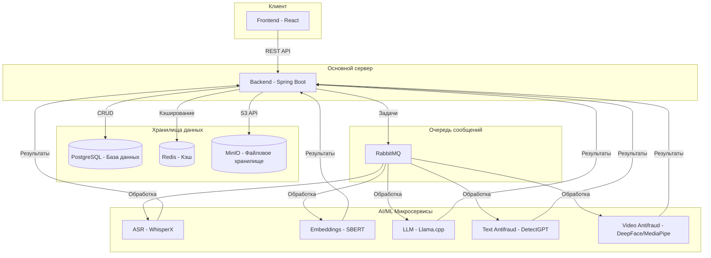

# HR Assistant — AI-система для проведения интервью

     

**HR Assistant** — это комплексная платформа для автоматизации технических интервью. Система записывает и анализирует ответы кандидатов, предоставляет оценку соответствия требованиям вакансии и помогает рекрутерам принимать взвешенные решения с помощью AI.

## 🚀 Ключевые возможности

- **Автоматическая транскрипция**: Преобразование аудиоответов в текст с помощью `WhisperX`.
- **Семантический анализ**: Сравнение ответов кандидата с требованиями вакансии с использованием `SBERT`.
- **AI-ассистент**: Генерация объяснений (`LLM`) о том, почему кандидат подходит или не подходит.
- **Антифрод-система**: Обнаружение AI-сгенерированного текста (`DetectGPT`) и анализ видеопотока (`DeepFace`, `MediaPipe`) для обеспечения честности процесса.
- **Централизованный мониторинг**: Сбор метрик и логов с помощью `Prometheus`, `Grafana` и `ELK Stack`.
- **Масштабируемая архитектура**: Набор микросервисов, управляемых через `Docker Compose` и готовых к развертыванию в `Kubernetes` с помощью `Helm`.

## 🏗️ Архитектура системы

Диаграмма ниже иллюстрирует взаимодействие основных компонентов системы.



## 🛠️ Технологический стек

| Компонент                | Технологии                               |
| ------------------------ | ---------------------------------------- |
| **Frontend**             | React, TypeScript, Vite, Tailwind CSS    |
| **Backend**              | Java 17, Spring Boot, Spring Security    |
| **База данных**          | PostgreSQL, Redis                        |
| **AI/ML сервисы**        | Python, FastAPI, SBERT, Llama.cpp, WhisperX |
| **Хранилище**            | MinIO (S3-совместимое)                   |
| **Очередь сообщений**    | RabbitMQ                                 |
| **Мониторинг**           | Prometheus, Grafana, ELK Stack           |
| **Развертывание**        | Docker, Docker Compose, Kubernetes (Helm)|

## 🚀 Быстрый старт

Для запуска проекта локально убедитесь, что у вас установлены `Docker` и `Docker Compose`.

1. **Клонируйте репозиторий:**
   ```sh
   git clone <URL репозитория>
   cd hr-assistant
   ```

2. **Создайте файл с переменными окружения:**
   Скопируйте `env.example` в `.env` и при необходимости измените значения.
   ```sh
   cp env.example .env
   ```

3. **Запустите все сервисы:**
   Эта команда соберет образы (если необходимо) и запустит все контейнеры в фоновом режиме.
   ```sh
   docker compose up --build -d
   ```

4. **Проверьте статус контейнеров:**
   ```sh
   docker compose ps
   ```

После успешного запуска сервисы будут доступны по следующим адресам:
- **Frontend**: `http://localhost:3000`
- **Backend API**: `http://localhost:8081/api/v1`
- **Swagger UI**: `http://localhost:8081/api/v1/swagger-ui/index.html`
- **MinIO Console**: `http://localhost:9003`
- **Grafana**: `http://localhost:3001`

## 📜 Лицензия

Проект распространяется под лицензией MIT. Подробности см. в файле `LICENSE`.
